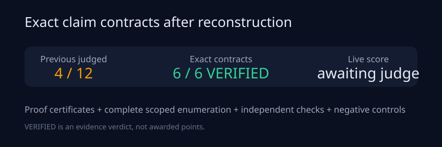
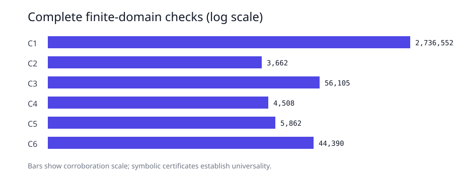
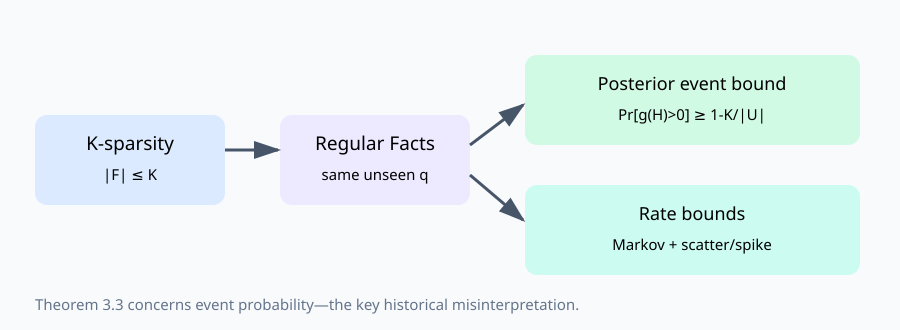
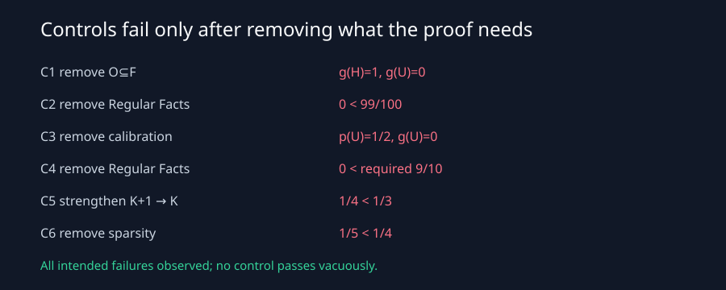

# Innovation and hallucination: six theorem claims rebuilt

The paper asks a clean theoretical question: if a language model assigns mass
outside its training corpus—if it *innovates*—when must that mass include
hallucinations? Its “language model” is deliberately abstract: a map from a
finite corpus to a probability distribution over statements. Our reproduction
therefore tests the exact probability statements, not a proxy neural benchmark.

## What changed

The judged baseline assigned `g(U)` and `g(H)` by hand, used an inadmissible
endpoint that made Theorem 4.1 zero, and treated Theorem 3.3's posterior event
probability as if it were hallucination mass. We replaced those checks with:

1. explicit JSON claim contracts containing assumptions and quantifiers;
2. independently reconstructed symbolic derivations using exact fractions;
3. exhaustive enumeration over complete, declared finite domains;
4. independent implementations or closed-form checks;
5. controls that remove one necessary assumption or strengthen a sharp bound.

We then added a separate native-scale layer: 160,000 simulated corpora across
four predeclared regimes, universes up to 20,000 statements, and scatter,
spike, and calibrated model families. This measures theorem observables at
scale; it does not replace the proof certificates.

The fixed code path is short: `repro_campaign.run` first rechecks the immutable
judge/Space hashes, reruns Claim 1's set certificate, then calls the exact
Claim 2–6 audits in `repro_campaign.theorems`. Each result is compared with its
committed raw JSON fixture; any difference exits nonzero.

## The central correction

Theorem 3.3 says

`Pr[g(H)>0 | X] >= 1-K/|U|`.

It does **not** say `g(H)>=1-K/|U|`. Under Regular Facts every unseen statement
has factual posterior probability `q`; K-sparsity gives `|U|q<=K`. A statement
receiving positive model mass is therefore hallucinated with probability at
least `1-K/|U|`. The old `g(H)≈0.10` output neither tested nor contradicted this
event-probability statement.

## Results

| Claim | Exact observed evidence | Control |
| --- | --- | --- |
| 1 | 2,736,552 rational models, zero counterexamples | remove `O⊆F`: implication fails |
| 2 | 171,699 symbolic + 3,662 posterior models | remove Regular Facts: probability bound fails |
| 3 | 56,105 distributions/partitions | remove calibration: missing mass need not innovate |
| 4 | 2,359 substitutions + 4,508 positive bounds | remove Regular Facts: Markov event fails |
| 5 | 4,500 case splits + 5,862 models | replace `K+1` by `K`: sharp counterexample |
| 6 | 44,390 models; 43,390 nonzero-TV | remove sparsity: `1/5 < 1/4` |

At native scale, spike hallucination frequencies were 0.998225, 0.958075, and
0.845875 against floors 0.997498, 0.949648, and 0.830621. Their 95% Wilson
intervals were [0.997762,0.998592], [0.956067,0.959995], and
[0.842303,0.849380]. Scatter met Claims 4–5 in every run. Claim 6 used exact
cell-summed TV and exercised nonzero TV in 320,000 evaluations.

The proof certificates use exact rational arithmetic; native Monte Carlo
reports Wilson and paired-difference intervals. Neither finite scope is the
basis for universal claims. Universality comes from the reconstructed set,
conditioning, expectation, case-split, and total-variation arguments.

## Compute and provenance

Every completed run used the inherited command
`uv run --frozen python -m repro_campaign.run` and the same `uv.lock`.
Historical exact-certificate runs used supervised local CPU. Native and
judge-readable runs used HF `cpu-upgrade` because the first native runtime was
uncertain; both completed in 37 seconds wall and about 20 seconds verifier
time with a one-thread process. At $0.0005/minute, each 30-second running
interval cost nominally about $0.00025.

The experiment lineage is:
[historical audit](https://github.com/MachineLearning-Nerd/icml26-repro-iSD2q5Tius-innovation-an-almost-characterization-of-hallucination/tree/orx/historical-judged-baseline-audit)
→ [Claim 1 certificate](https://github.com/MachineLearning-Nerd/icml26-repro-iSD2q5Tius-innovation-an-almost-characterization-of-hallucination/tree/orx/claim-1-exact-set-certificate)
→ [Claim 1 visible package](https://github.com/MachineLearning-Nerd/icml26-repro-iSD2q5Tius-innovation-an-almost-characterization-of-hallucination/tree/orx/claim-1-evaluator-visible-package)
→ [cumulative Claims 2–6](https://github.com/MachineLearning-Nerd/icml26-repro-iSD2q5Tius-innovation-an-almost-characterization-of-hallucination/tree/orx/exact-certificates-for-claims-2-through-6)
→ [release candidate](https://github.com/MachineLearning-Nerd/icml26-repro-iSD2q5Tius-innovation-an-almost-characterization-of-hallucination/tree/orx/evaluator-visible-release-candidate)
→ [native scale](https://github.com/MachineLearning-Nerd/icml26-repro-iSD2q5Tius-innovation-an-almost-characterization-of-hallucination/tree/orx/native-scale-inline-proof-release)
→ [judge-readable package](https://github.com/MachineLearning-Nerd/icml26-repro-iSD2q5Tius-innovation-an-almost-characterization-of-hallucination/tree/orx/judge-readable-native-proof-package).

## Assessment

All six exact contracts are VERIFIED with HIGH confidence. The live score
before this candidate is 6/12. The evidence does not promise 12/12:
evaluator interpretation remains an external risk, and only the live judge can
award points. Historical revisions remain preserved; current navigation makes
the superseding verifier obvious while keeping every old page reachable.
